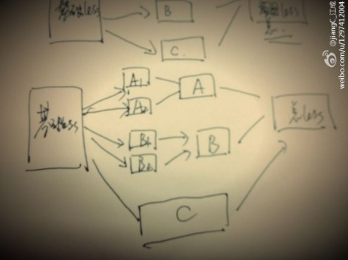

#Less生成CSS冗余测试 **less**

by jiangC

##基本结构（测试版本1.3.0）

##测试
###测试一：基础库为class

**基础LESS**

	.base{
	    text-align:e("base");
	}

**a1.less**
	
	@import "base";

	.a1{
	    text-align:e("a1");
	}

**a2.less**

	@import "base";

	.a2{
	    text-align:e("a2");
	}

**a.less**

	@import "a1";
	@import "a2";

	.a{
	    text-align: e("a");
	}
	
**b1.less**

	@import "base";

	.b1{
	    text-align:e("b1");
	}

**b2.less**
	
	@import "base";

	.b2{
	    text-align:e("b2");
	}
	
**b.less**

	@import "b1";
	@import "b2";

	.b{
	    text-align: e("b");
	}
	
**c.less**

	@import "base";

	.c{
	    text-align:e("c");
	}
	
**output.less**
	
	@import "a";
	@import "b";
	@import "c";
	.output{
	    text-align:e("output");
	}

**最终生成的CSS文件如下**

	.base{text-align:base;}
	.a1{text-align:a1;}
	.base{text-align:base;}
	.a2{text-align:a2;}
	.a{text-align:a;}
	.base{text-align:base;}
	.b1{text-align:b1;}
	.base{text-align:base;}
	.b2{text-align:b2;}
	.b{text-align:b;}
	.base{text-align:base;}
	.c{text-align:c;}
	.output{text-align:output;}
	
	
> 即：基础class会被多次重写

###测试二：基础库为func.

**基础LESS**

	.baseMain(){
	    text-align:e("baseMain func");
	}

	.basePartial(){
	    text-align:e("basePartial func");
	}

**只在a1.less中使用**

	@import "base";

	.a1{
	    text-align:e("a1");
	    .baseMain();
	}

在a2.less\b1.less\b2.less中没有调用这些func，但是有
	
	@import "base";

最终生成的CSS文件如下：

	.a1{text-align:a1;text-align:baseMain func;text-align:baseMain func;text-align:baseMain func;text-align:baseMain func;}
	.a2{text-align:a2;}
	.a{text-align:a;}
	.b1{text-align:b1;}
	.b2{text-align:b2;}
	.b{text-align:b;}
	.c{text-align:c;}
	.output{text-align:output;}
	
可以看到.a1的样式中生成了4个base Main func的样式。**这个数字和base.less 被引用的次数相同，和其内函数的调用次数是不同的**。

###测试三：添加多base.less 引用，验证测试二

测试二中只有a2.less\b1.less\b2.less调用了base.less，现在在a.less/b.less中添加对base.less的引用，预期应该会生成6个base Main func的样式。如下:

**a.less**

	@import "base";
	@import "a1";
	@import "a2";

	.a{
	    text-align: e("a");
	}

**b.less**
	
	@import "base";
	@import "b1";
	@import "b2";

	.b{
	    text-align: e("b");
	}

**最终生成css如下**

	.a1{text-align:a1;text-align:baseMain func;text-align:baseMain func;text-align:baseMain func;text-align:baseMain func;text-align:baseMain func;text-align:baseMain func;}
	.a2{text-align:a2;}
	.a{text-align:a;}
	.b1{text-align:b1;}
	.b2{text-align:b2;}
	.b{text-align:b;}
	.c{text-align:c;}
	.output{text-align:output;}

刚好6个baseMain func，如预期。

###测试四：单点函数调用，多点import

在测试二和测试三中真正调用base.less中的函数的是a1.less，其他的只是import进来。现在在b.less中调用base.less中的.basePartial()函数。对base.less的函数调用和import的情况如下：

对base.less 的调用

**a1.less**
	
	@import "base";

	.a1{
	    text-align:e("a1");
	    .baseMain();
	}
	

**b.less**
	
	@import "base";
	@import "b1";
	@import "b2";

	.b{
	    text-align: e("b");
	    .basePartial();
	}

import  base.less 的文件除了a1.less、b.less外还有b1.less、b2.less，总共4个文件。

按照预期，出现.basePartial()和.baseMain()的次数和base.less 被import进来的次数息息相关。这个次数应该是4.

输出结果如下：

	.a1{text-align:a1;text-align:baseMain func;text-align:baseMain func;text-align:baseMain func;text-align:baseMain func;}
	.a2{text-align:a2;}
	.a{text-align:a;}
	.b1{text-align:b1;}
	.b2{text-align:b2;}
	.b{text-align:b;text-align:basePartial func;text-align:basePartial func;text-align:basePartial func;text-align:basePartial func;}
	.c{text-align:c;}
	.output{text-align:output;}

可以看到的是baseMain 和 basePartial 的调用均为4次

##结论

所以基础less要足够精致，一旦当被import进来的次数很多以后，生成css文件的也会变大，最重要的是，这里面的冗余很多。

