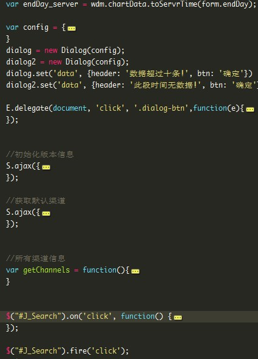

#SMACSS实践——之WDM **SMACSS实践**

by jiangC

##原样式.

+ DOM层数多，class多
+ 样式没有合理的组织结构
+ 希望复用组件，但是可用性很低。

##改造——fix的策略

**保留原来的layout的样式：layout样式保留**

**保留部分module的样式：**

+ 保持风格（全部重构，工作量很大），比如遵循tmpl的DOM结构都是在assets-js.vm中定义。
+ 原结构复杂（DOM ，样式 搞得过于复杂），分类不太明确。

    1)DOM操作、返回JSON DOM渲染，shared memory（data structure），ajax server混合在一起

    2)fix多数需要使用组件完成，但是每个组件的耦合性太大，牵扯到多个文件；还有就是，对同一个样式的hack/mix/reset太多，而且分布在不同的文件。
    例如，tab页的样式和多个文件关联，补丁打得过多（分散在不同的文件中）：

**提取组件**

