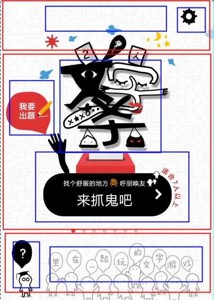
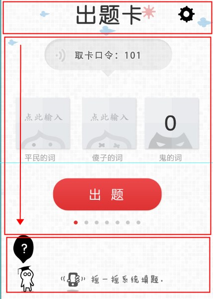

#SMACSS实践——之文字杀 **SMACSS实践**

by jiangC

每一层只考虑每一层需要考虑的东西，这样做的好处有两个：

1.将问题简化
2.无干扰(干扰意味着问题又复杂化)

##Theme style

##Base style

##Layout style

然而实际上，中间部分是变高的，在没有css trick的情况下（本例中可将文字杀图片设置成绝对定位），也可以将其归类到Module的范围内中去。

##Module style

##State style

##Changing style
