#适合移动端的组件（基于H5实践） **移动端组件**

by jiangC

写此篇的目的，完全是因为在读bootStrap后将其部分搬到Mixcss发现诸多“水土不服”的地方，移动端的组件还是与PC上的组件有诸多不同点的。

+ PC代表：bootStrap

+ Mobile代表： H5 、 taobaoPad 、Jquery Mobile(Native)

##操作方式区别

**一些伪类**

这在一些标签的使用上就有所不同，如PC上使用hover：

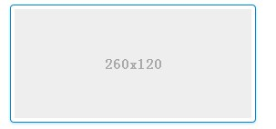

但是在Mobile端就不需要考虑这种情况，要考虑的情况可能是focus，disable，readonly等这些情况。

**滚动VS滑动**

这块在样式上的区别还算比较小。但是在一些JS动作上区别比较大。

##组件展现

###button

1.下面是bootStrap的button呈现方式：

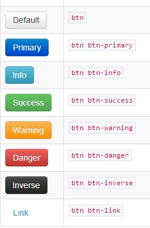

再看一下H5 和 Jquery Mobile（类似Native）的按钮样式

2.H5：

3.Jquery Mobile（Native）：

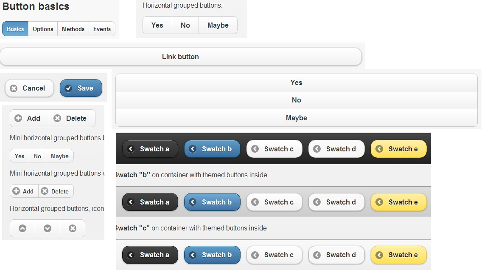

比较起来，H5 和 Jquery Mobile 重视手指点击区域、在有限区域的分辨度的设计，而bootStrap基于PC，这点并不突出。

**因此，MixCss在提供的样式依据为点击区域、辨识度等CSS属性。**

##Tables

bootStrap的Tables:
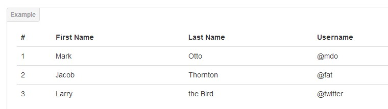

**这类组件在Mobile上应用场景很少。**

##Form:Legend

bootStrap的Legend:

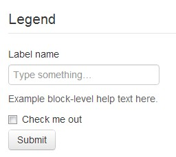

**目前H5和TaobaoPad都没有应用。此类控件场景相对较少（或者用控件拼合，如label，hr）。**

##Form:Inputs

输入框：

bootStrap的Inputs:

**和移动端的区别还是在于一些伪类，如hover，mousein，mouseout，除去这些其他和移动端基本一致。 **

##Form:TextArea

文本区：

bootStrap的TextArea:

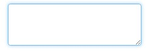

**在某些属性上：如大小可拖动。在Mobile上并不太适用。**

##Form: Checkboxes and radios

单选、复选框：

bootStrap:

Mobile的样式：

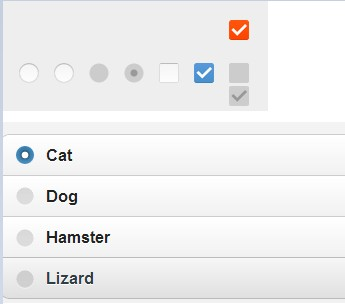

**和Button类似，Mobile端更突出点击区域、辨识度。这部分的CSS属性可能是宽、高、定制的背景等等**

##Form: select

选择框：

bootStrap:
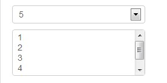

Mobile的样式：
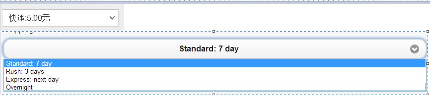

**同上，点击区域、辨识度。**

##Form: 混合

Form混合类：

bootStrap:
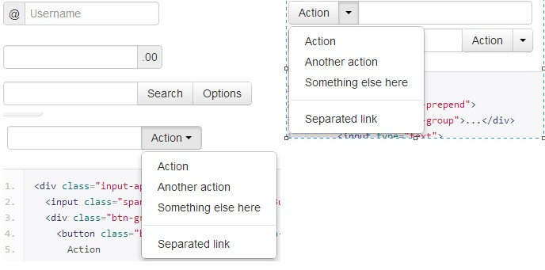

Mobile的混合样式：

##Images&icons

图片、图标类：

暂时没发现太大区别

##nav&nav bar

导航、导航条：

bootstrap：
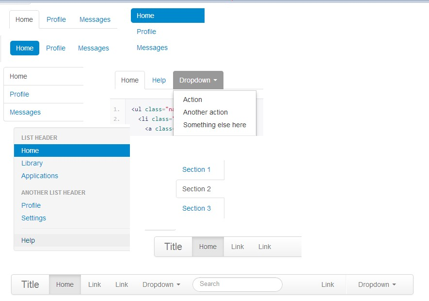

Mobile：
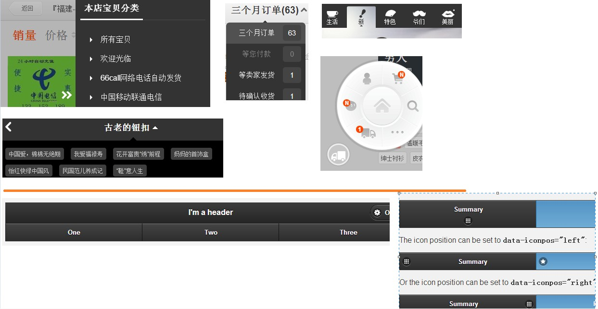

此外，一些list也是导航：
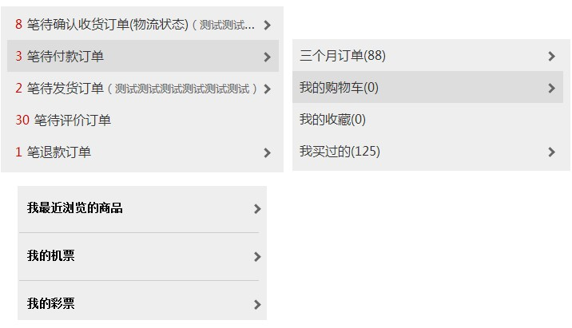

包括一些header，也算是一种导航：

**和PC相比，Mobile的设计->占用空间灵活（隐藏）、简约**

##Breadcrumbs

面包屑：

bootStrap:
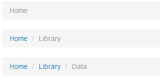

Mobile：

**受限于点击区域，此类控件基本被导航条代替**

##Pagination

分页：

bootStrap:

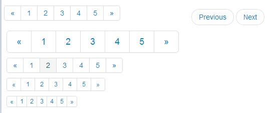

Mobile：

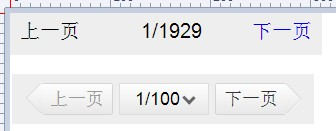

**相比较而言，Mobile的强调点击区域、辨识度。**

##Labels and badges

标签、徽章类：

bootStrap:

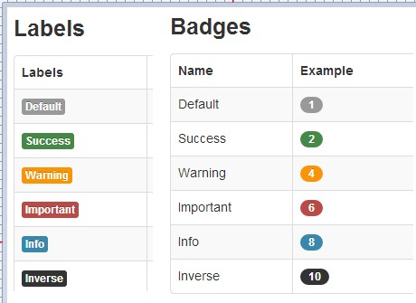

Mobile:

**没有特别的区别**

##Typograghy

字体，排版类：

bootStrap:

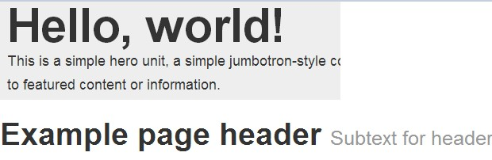

Mobile：
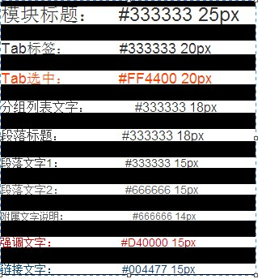

**在字体和排版上主要还是根据设计约定，如果有针对字体的响应式设计的话，可能会有诸如em单位的使用**

##Thumbnails

缩略图类：

bootStrap:

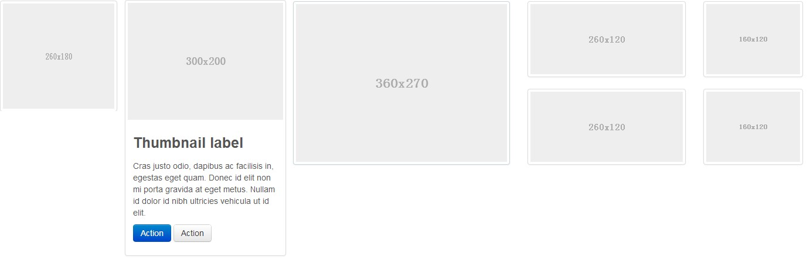

Mobile：

**Mobile在对空间利用要求更加高，紧凑，简明，突出；另外一个就是响应式，现在的H5还是固定列宽，而Bootstrap已经做了响应式的Grid布局，MixCss也尽力将响应式引入到Mobile端，特别是针对这种Thumbnails（因为它占据整个页面的主体）**

##Alerts&Popup

弹框类

bootStrap:

Mobile:

##Progress bars

For loading, redirecting, or action status

booStrap：

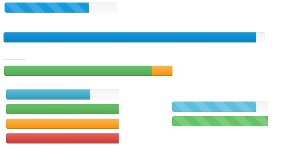

Mobile：

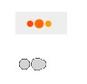

**这种等待还是被类似“菊花”的这种占用空间小，同时表达清晰的图标代替**

##Media object

booStrap：

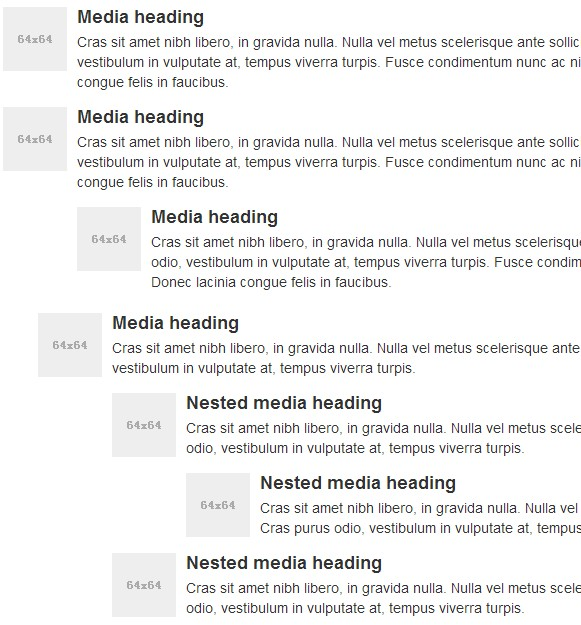

Mobile：

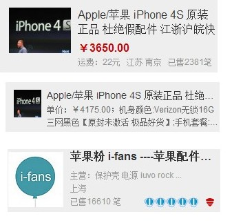

**从文字排版到表达信息基本一致，只是在空间利用上有些差别**

##Slider(banner)

PC:

Mobile:

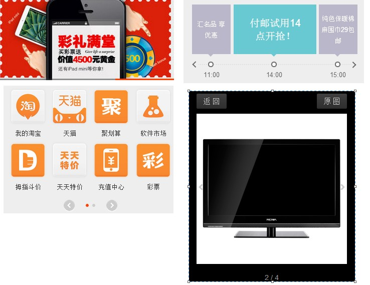

**在Slider上PC端以banner展示为主，而Mobile端除了banner展示，加入了一些滑动的手势**

##Footer

PC:

Mobile:

**展示的信息量、占用空间的区别**

##Responsive##

响应式设计

PC:

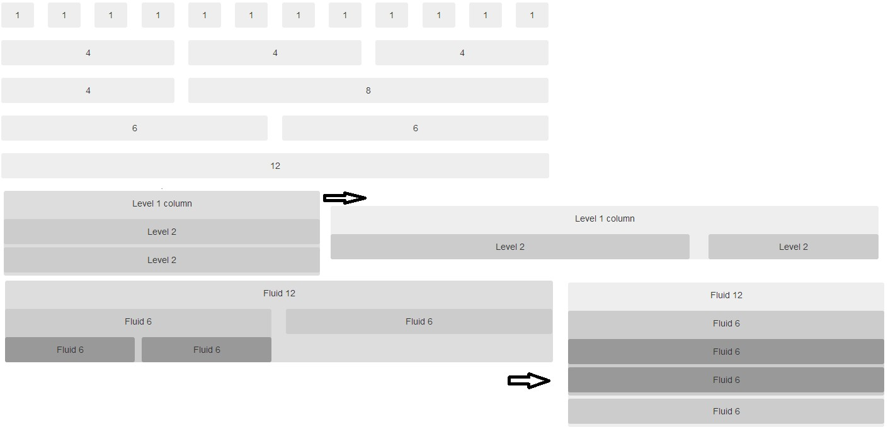

Mobile：

**H5在这块以固定布局设计，在MixCss中尝试加入Grid流式布局**

