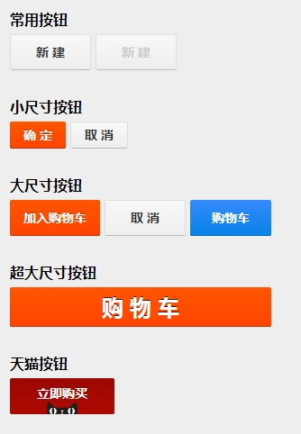

#适合移动端的组件 **移动端组件**

写此篇的目的，完全是因为在读bootStrap后将其部分搬到Mixcss发现诸多“水土不服”的地方，移动端的组件还是与PC上的组件有诸多不同点的。

##操作方式

**一些伪类**

这在一些标签的使用上就有所不同，如PC上使用hover：

但是在Mobile端就不需要考虑这种情况，要考虑的情况可能是focus，disable，readonly等这些情况。

**滚动VS滑动**

这块在样式上的区别还算比较小。但是在一些JS动作上区别比较大。

##组件展现

###button

1.下面是bootStrap的button呈现方式：

再看一下H5 和 Jquery Mobile（类似Native）的按钮样式

2.H5：

3.Jquery Mobile（Native）：

比较起来，H5 和 Jquery Mobile 重视手指点击区域的设计，而bootStrap基于PC，还是基于点。

