# 图解Git **git**

***此文来源于网络***

如果你稍微理解git的工作原理，这篇文章能够让你理解的更透彻。

## 基本用法

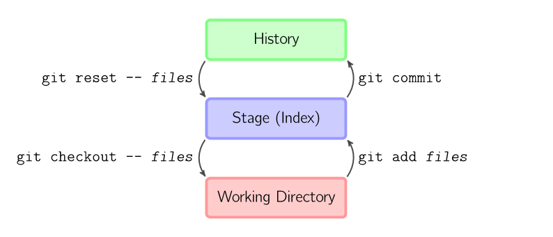

上面的四条命令在工作目录、暂存目录(也叫做索引)和仓库之间复制文件。

* `git add files` 把当前文件放入暂存区域。
* `git commit` 给暂存区域生成快照并提交。
* `git reset -- files` 用来撤销最后一次git add files，你也可以用git reset 撤销所有暂存区域文件。
* `git checkout -- files` 把文件从暂存区域复制到工作目录，用来丢弃本地修改。

你可以用 `git reset -p`, `git checkout -p`, 或者 `git add -p`进入交互模式。

也可以跳过暂存区域直接从仓库取出文件或者直接提交代码。

* `git commit -a` 相当于运行 git add 把所有当前目录下的文件加入暂存区域再运行。git commit.
* `git commit files` 进行一次包含最后一次提交加上工作目录中文件快照的提交。并且文件被添加到暂存区域。
* `git checkout HEAD -- files` 回滚到复制最后一次提交。

## 约定

后文中以下面的形式使用图片。

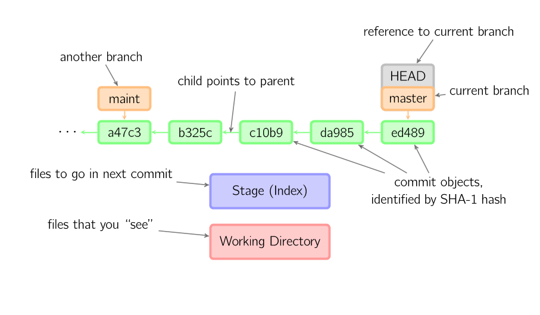

绿色的5位字符表示提交的ID，分别指向父节点。分支用橘色显示，分别指向特定的提交。当前分支由附在其上的HEAD标识。 这张图片里显示最后5次提交，ed489是最新提交。 master分支指向此次提交，另一个maint分支指向祖父提交节点。

## 命令详解

### [Diff](#diff)

有许多种方法查看两次提交之间的变动。下面是一些示例。

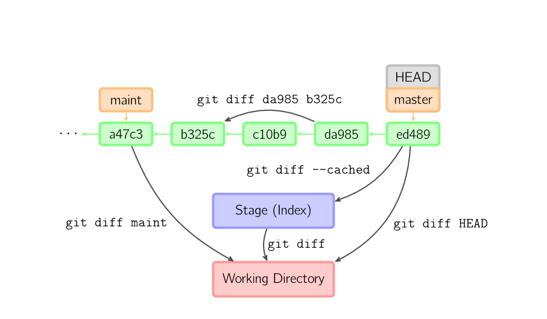

### [Commit](#commit)

提交时，git用暂存区域的文件创建一个新的提交，并把此时的节点设为父节点。然后把当前分支指向新的提交节点。下图中，当前分支是master。 在运行命令之前，master指向ed489，提交后，master指向新的节点f0cec并以ed489作为父节点。

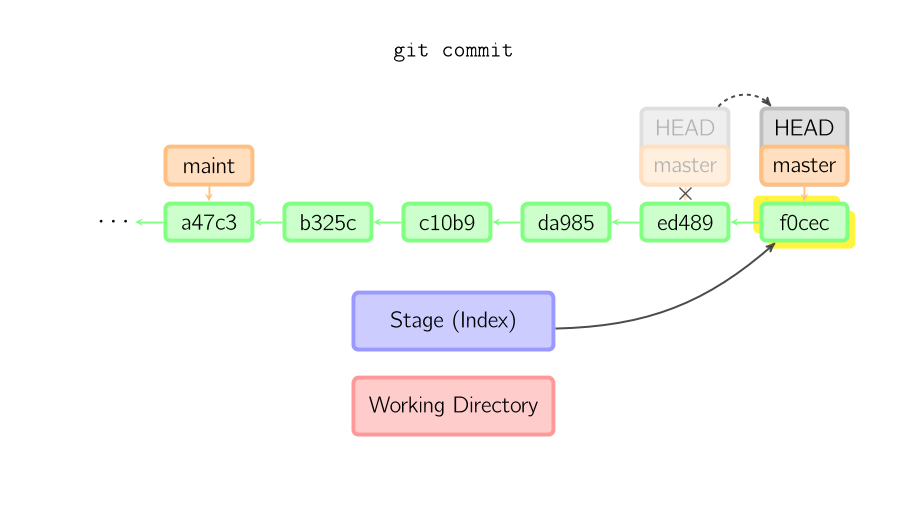

即便当前分支是某次提交的祖父节点，git会同样操作。下图中，在master分支的祖父节点maint分支进行一次提交，生成了1800b。 这样，maint分支就不再是master分支的祖父节点。此时，[合并](#merge) (或者 [复位](rebase)) 是必须的。

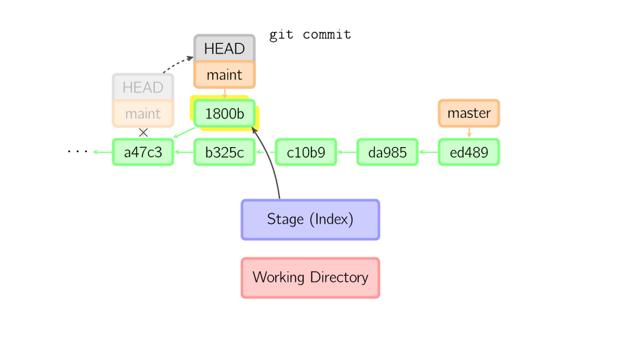

如果想更改一次提交，使用 git commit --amend。git会使用与当前提交相同的父节点进行一次新提交，旧的提交会被取消。

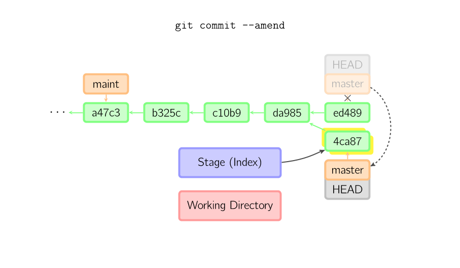

另一个例子是[分离](#detached),后文讲。

### [Checkout](#checkout)

checkout命令通常用来从仓库中取出文件，或者在分支中切换。

checkout命令让git把文件复制到工作目录和暂存区域。比如git checkout HEAD~ foo.c把文件从foo.c提交节点HEAD~ (当前提交节点的父节点)复制到工作目录并且生成索引。注意当前分支没有变化。

如果没有指定文件名，而是一个本地分支，那么将切换到那个分支去。同时把索引和工作目录切换到那个分支对应的状态。

如果既没有指定文件名，也没有指定分支名，而是一个标签、远程分支、SHA-1值或者是像master~3类似的东西，就得到一个匿名分支，称作detached HEAD。 这样可以很方便的在历史版本之间互相切换。但是，这样的提交是完全不同的。、

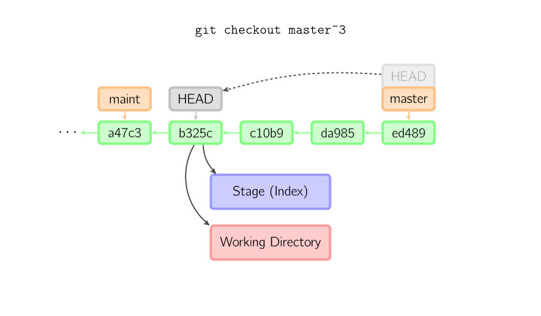

### [Detached](#detached)

HEAD是分离的时候, 提交可以正常进行, 但是没有更新已命名的分支. 。(可以看作是匿名分支。)

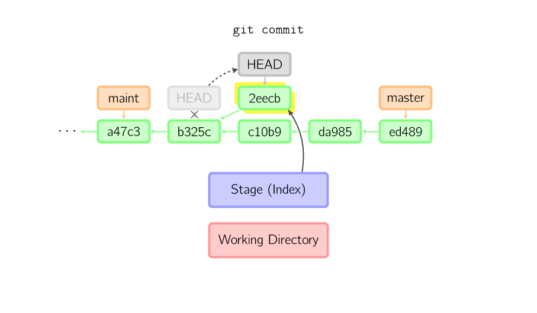

如果此时切换到别的分支，那么所作的工作会全部丢失。注意这个命令之后就不存在2eecb了。

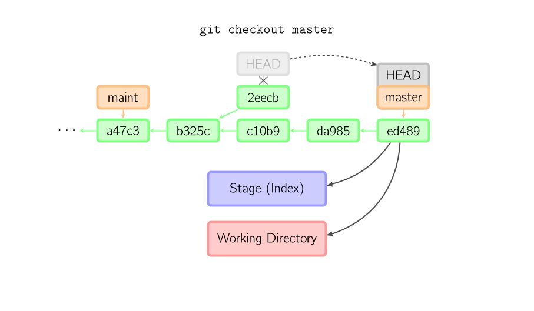

如果你想保存当前的状态，可以用这个命令创建一个新的分支: `git checkout -b name`。

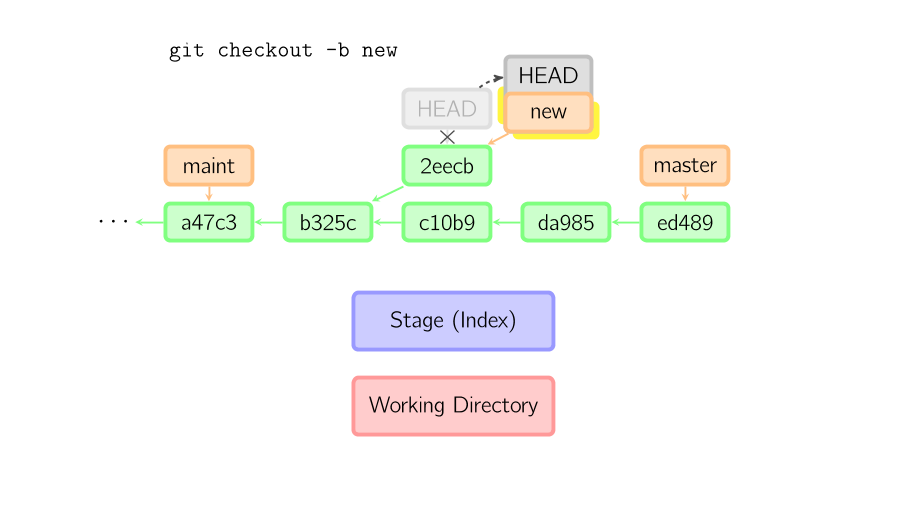

### [Reset](#reset)

reset命令把当前分支指向另一个位置，并且有选择的变动工作目录和索引。也用来在从历史仓库中复制文件到索引，而不动工作目录。

如果不给选项，那么当前分支指向到那个提交。如果用--hard选项，那么工作目录也更新，如果用--soft选项，那么都不变。

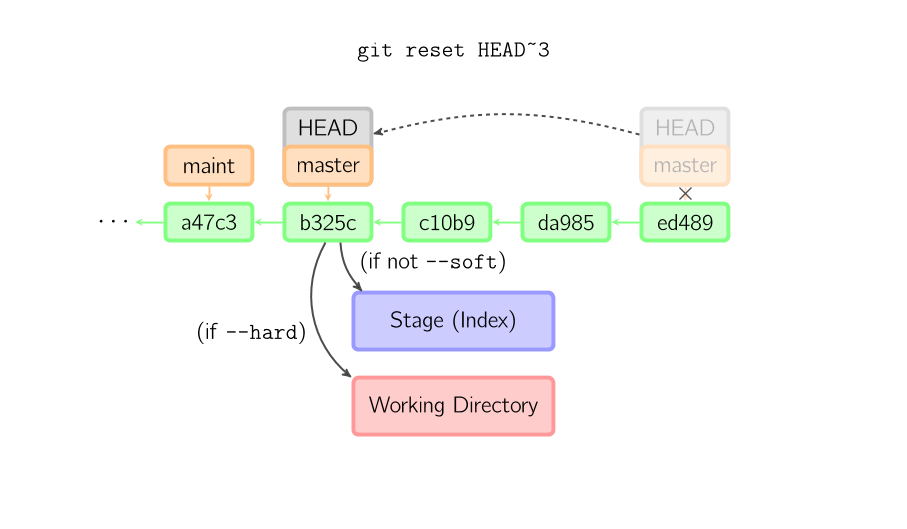

如果没有给出提交点的版本号，那么默认用HEAD。这样，分支指向不变，但是索引会回滚到最后一次提交，如果用--hard选项，工作目录也同样。

如果给了文件名(或者 -p选项), 那么工作效果和带文件名的[checkout](#checkout)差不多，除了索引被更新。

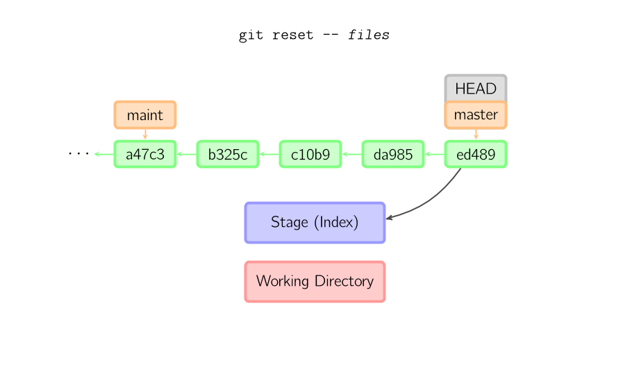

### [Merge](#merge)

merge 命令把不同分支合并起来。合并前，索引必须和当前提交相同。如果另一个分支是当前提交的祖父节点，那么合并命令将什么也不做。 另一种情况是如果当前提交是另一个分支的祖父节点，就导致fast-forward合并。指向只是简单的移动，并生成一个新的提交。

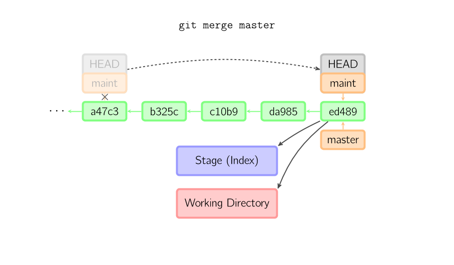

否则就是一次真正的合并。默认把当前提交(ed489 如下所示)和另一个提交(33104)以及他们的共同祖父节点(b325c)进行一次[三方合并](http://en.wikipedia.org/wiki/Three-way_merge)。结果是先保存当前目录和索引，然后和父节点33104一起做一次新提交。

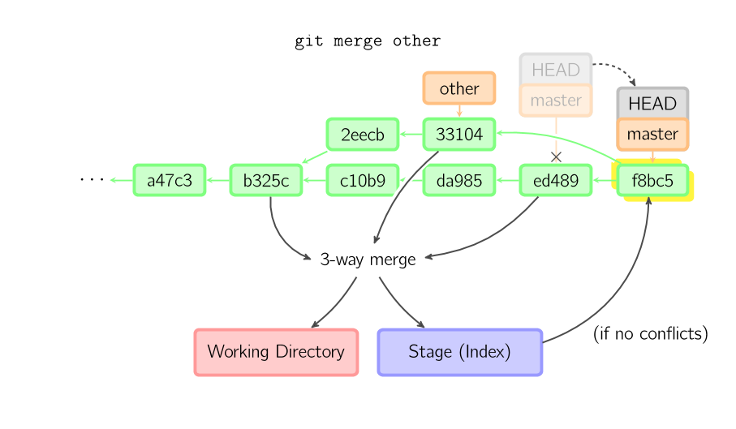

### [Cherry Pick](#cherry-pick)

`cherry-pick`命令"复制"一个提交节点并在当前复制做一次完全一样的新提交。

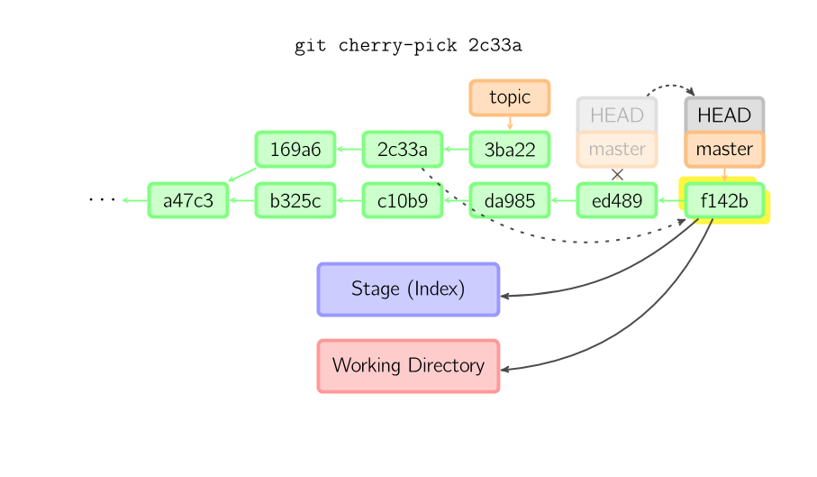

### [Rebase](#rebase)

复位是合并命令的另一种选择。合并把两个父分支合并进行一次提交，提交历史不是线性的。复位在当前分支上重演另一个分支的历史，提交历史是线性的。 本质上，这是线性化的自动的 [cherry-pick](#cherry-pick)

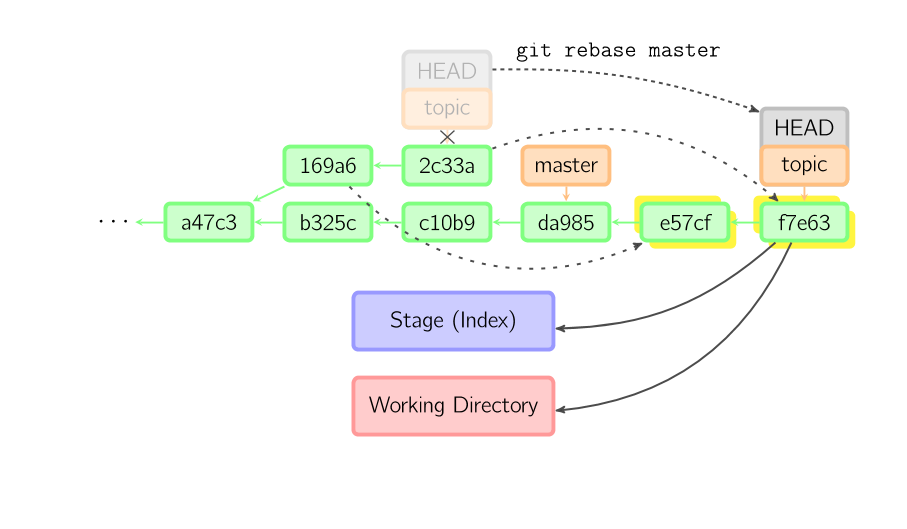

上面的命令都在topic分支中进行，而不是master分支，在master分支上重演，并且把分支指向新的节点。注意旧提交没有被引用，将被回收。

要限制回滚范围，使用--onto选项。下面的命令在master分支上重演当前分支从169a6以来的最近几个提交，即2c33a。

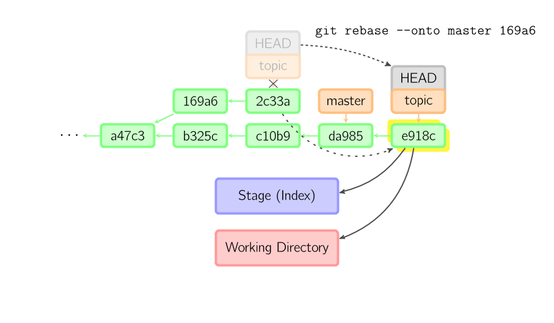

同样有`git rebase --interactive`让你更方便的完成一些复杂操组，比如丢弃、重排、修改、合并提交。没有图片体现着下，细节看这里:[git-rebase(1)](http://www.kernel.org/pub/software/scm/git/docs/git-rebase.html#_interactive_mode)

## 技术说明

文件内容并没有真正存储在索引(.git/index)或者提交对象中，而是以blob的形式分别存储在数据库中(.git/objects)，并用SHA-1值来校验。 索引文件用识别码列出相关的blob文件以及别的数据。对于提交来说，以树(tree)的形式存储，同样用对于的哈希值识别。树对应着工作目录中的文件夹，树中包含的 树或者blob对象对应着相应的子目录和文件。每次提交都存储下它的上一级树的识别码。

如果用detached HEAD提交，那么最后一次提交会被the reflog for HEAD引用。但是过一段时间就失效，最终被回收，与`git commit --amend`或者`git rebase`很像。
