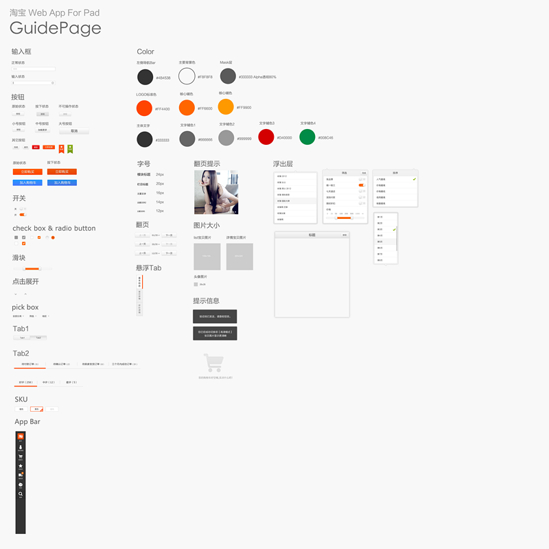
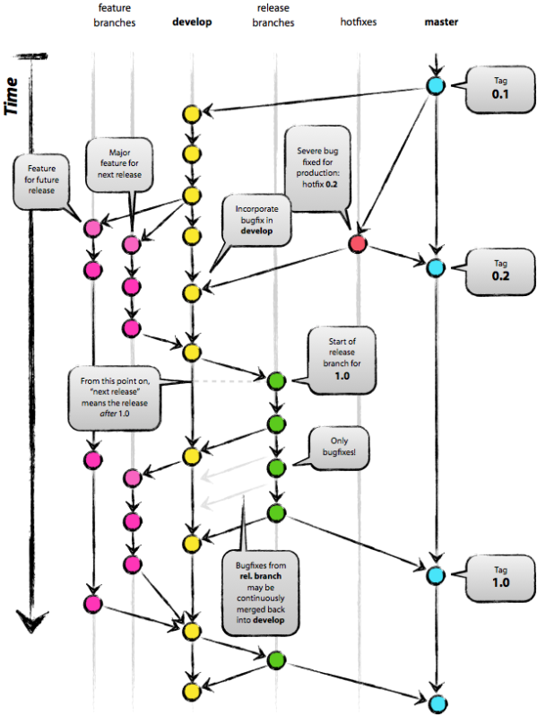

# No.2012.11.22 **brief**

##整体进展

* MIX正式更名为Mixjs。同时MIX将以平台的方式展现，包括JS框架，CSS框架，代码托管，开发工具集，组件库，流程化、自动化建设等等。
* Mixjs v0.1完成，打上tag，正式同步到Github。
* 在整个团队中推广框架，etao H5正式采用MIX。
* 淘宝H5 for ipad版，进展70%。

### Mixjs（v0.1）

**导航管理** 

用于匹配浏览器的前进后退，记录浏览历史。在backbone的router/history/event的基础上，优化性能和逻辑。

* Event支持@的发送方式（特定某个消息主体），或者泛发送方式（所有同名的消息）。
* History去除对pushState的支持，并优化hash的处理。
* Router加入state的管理，加入对!a=b&c=d的参数支持。

**应用管理** 

管理webapp中的每个应用，包括生命周期，状态持久化，消息通信等。

* Navigator 用有限的内存分配机制来管理各个应用。各个应用在生命周期内，存在内存建立和销毁，且每个应用的内存保持独立。
* Controller 对某个应用进行管理，包括整个生命周期内的流程，以及对视图的加载和管理。
* View 承载某个应用的视图展现，同时以规范来约束代码编写，使得团队开发的代码更加一致。

**模板引擎**

支持局部更新机制的模板引擎，可以降低DOM的大面积重绘带来的性能损耗。

* Template 扩展自handlebars。支持以字符串形式局部更新，以及DOM替换方式局部更新。并以两次编译的方式，来提高局部更新时，数据渲染的效率。

**组件开发** 

支持组件和模块的开发。

* module 无UI展现的功能模块。
* component 扩展自module，可以CSS和模板来渲染UI。

**特性检测**

包括网络状态，设备机型，浏览器版本等的检测。

### GitPower（alpha）

Git库，让团队能协作开发项目。

* 界面和功能更加接近于Github。
* 结合淘宝的发布流程，加入RMS发布的支持。
* 添加pull request功能，方便合并分支。
* 增加服务接口，可以用各种方式搭建HTTP服务。

访问地址：http://git.assets.m.etao.net/

### 开发者工具

每个工具，都是NPM的模块，可以用`npm install`的方式安装到本机，且同时支持win/linux/mac。

* spmbatch - 递归遍历模块，处理spm命令。
* fmonitor - 实时监控文件变更，并执行相应的命令。
* projinit - 项目初始化工具。

### 组件库

在原有淘宝H5组件库的基础上，结合淘宝H5 ipad版，完成的一套pad版组件。

目前的组件库积累，出自淘宝H5 pad版的设计。主要包括，输入框，按钮，开关，滑块，下拉框，Tab，SKU，导航栏，浮出层，翻页，色彩规范，字号规范。

###版本管理

基于Git的版本管理流程。

* 子模块式 - 每个应用是个独立的子模块，每个子模块维护自己的devel、release等分支。
* 分支式 - 每个应用独立一个分支，每个分支拥有完整的版本管理时间轴。
 

### 文档

更新了Mixjs的入门文档，目标是十分钟熟悉框架。开发手册是基于淘宝H5 for ipad项目的，同时对于普通的项目也有借鉴和参考意义。

* 入门文档：http://mixteam.git.assets.m.etao.net/mix/doc/GUIDE.html
* 开发手册：http://taobaopad.git.assets.m.etao.net/itaobao/doc/GUIDE.html

##接下去开发计划

###MIX JS

* 子模板
* 多视图独立渲染
* 模板和数据的绑定
* 应用间数据传递
* 支持非webapp开发
* 优化导航功能

###MIX CSS

提供基础功能、且宜扩展的BASE CSS。帮助解决各个版本移动浏览器兼容性的问题。

###测试

* 单元测试 - Seajs-jsmin plugin
* 压力测试 - 监控CPU，Memory，FPS

###优化组件开发

缩短开发和调试的流程

###MVVM探讨

探讨我们的业务和框架是否适合MVVM模式。

MVVM的例子：knockout.js、ember.js、win8 js