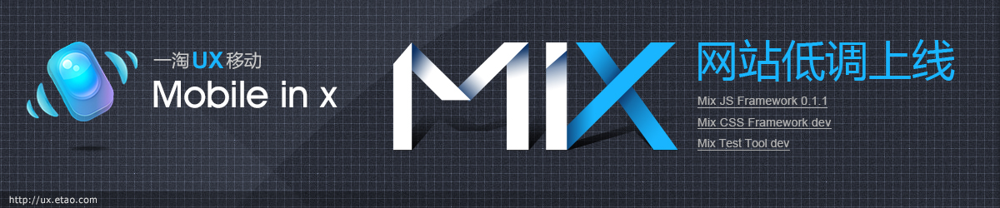
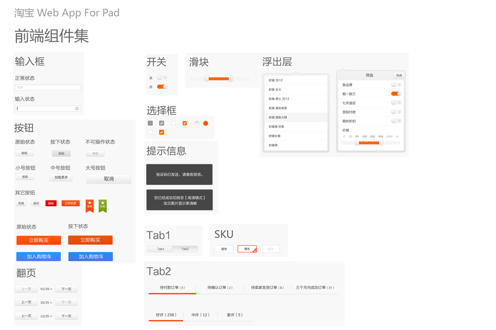
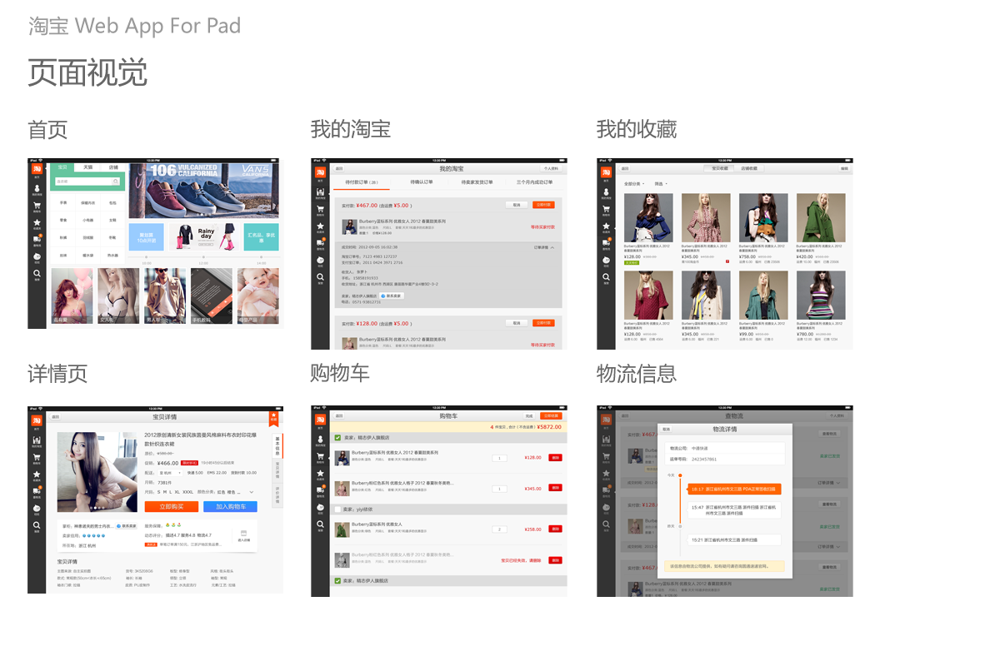

# Mix网站低调上线 **mix**

## 简介

MIX，Mobile In X的缩写。意为，在无线终端领域的各种解决方案。包括但不限于JS Framework、CSS Framework、UnitTest、Code Repository、Compnent Repository、Develop Tools。同时，mix也有混合之意。表示这些解决方案，是集合了业界的最佳实践，并取其精华，去取糟粕。

## 诞生

Mix项目始于今年9月份。这个极富含义的名称，正是@异翅 童鞋不经意的灵机一动，瞬息跃于纸上。大家一致认为，Mix蕴涵了一个全新的移动端解决方案应该遵循的设计原则。我们不希望造轮子，但又不满足于业界各种框架的存在缺陷，于是乎，Mix应运而生。

当初的Mix只是狭义的指代如今的Mixjs框架。借有业界知名的underscore、backbone、zepto、brix，我们重构了一套应用于移动端的JS MVC框架。以这个项目为起点，我们尝试自行搭建Git服务器（@徐宁），尝试通过Git来组织项目版本，尝试为Seajs加入localStorage功能（@玄寂），尝试探索浏览器本身的各种不同特性（@完颜），尝试用NodeJS来编写利于开发调试的工具（@渚薰）。这些我们团队的第一次，也是不少童靴的第一次。

## 开发

框架的开发用了将近一个半月时间，同时我们也深知，一个框架如果不能被实践检验就不能成为好的框架。也正是希望框架能够良性的迭代和发展下去，前端的童鞋就联合交互和视觉的童鞋发起了一个试验性的项目——淘宝H5 for iPad。我们希望借有一个完整的业务来纠正框架的各种不足。在视觉和交互的童鞋的参与下，很快便有了第一套视觉组件：

并且，在前辈Brix（@李牧）的帮助下，我们拥有了适合移动端的组件开发规范。并以这套规范，开发了完整的视觉组件。紧接着，淘宝整站基础业务的页面也出炉了（图片中罗列了部分页面）：

这些工作成果，不得不感谢@弈天、@神患 童鞋的艰辛付出。让我们更加有信心让框架成长下去。

## 里程碑

在整个项目的开发过程中，恰逢双11的年度活动，童鞋们在保证主线业务精益求精的前提下，依旧投入到项目中来，兢兢业业。接近年底了，也不知童鞋们的KPI都完成的如何了。这个ipad的试验项目也快要接近尾声，同时伴随其左右的JS框架，也正式发布0.1版，并正式更名为Mix JS。原有的MIX被赋予了平台的意义。令人高兴的事，一淘H5的项目也在这个时候启动了。在@子宽 童鞋的建议下，Mix JS将被用于一淘H5 webapp的开发，真正接受考验。同时，“有爱”也在考察Mix JS，希望能利用更加优秀的资源来让用户获得更加优秀的体验。

此次Mix平台网站的上线，也是为了能够规范Mix的文档，给Mix一个展示其自身魅力的空间。在网站上线之处，文章比较稀少，慢慢的会变得丰满，且高品质高质量。Mix平台的下一版开发也在如火如荼的进行当中，届时展示在大家面前的不仅仅只有JS框架，还会有CSS框架、测试工具，以及丰富的组件库。

## 感谢

最后，非常感谢为Mix奉献的童鞋：@异翅 @完颜 @江成 @曹纯 @徐宁 @岑安 @玄寂 @哓田 @子宽，以及所有关注Mix的童鞋们。同时也感谢@云杰 童鞋为Mix网站设计UI。