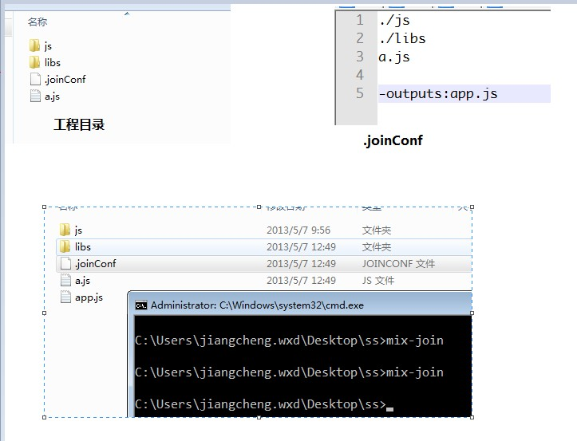

##安装

	npm install mix-join -g

仅windows下测试.

##功能

将指定的JS文件进行物理拼接（如需要，后期会加入uglifyjs、google closure compiler压缩）

##配置

1.在项目中创建.joinConf文件.

2.在.joinConf文件中依次列出需要拼接的JS的文件夹和JS文件名

例如 .joinConf文件内容如下：

    js/
    init.js
    ../a.js

    -outputs:../js/app.js

其中outputs为输出拼接的相对路径和文件名.

