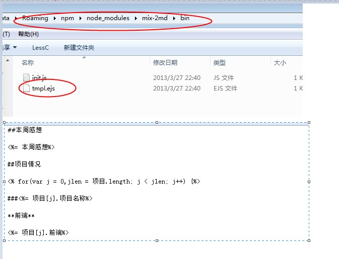
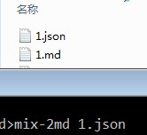

##安装

	npm install mix-2md -g
	
##JSON格式

	{
		"本周感想":"**",
		"项目":
		[{
		  "项目名称": "**",
		  "前端": "**",
		  "投入时间": "**",
		  "事项": [{
			"名称": "**",
			"开始时间": "03-18",
			"结束时间": "03-22"
		  },
		  {
			"名称": "**",
			"开始时间": "03-19",
			"结束时间": "03-19"
		  }]
		},
		{
		  "项目名称": "**",
		  "前端": "**",
		  "投入时间": "**",
		  "事项": [{
			"名称": "",
			"开始时间": "",
			"结束时间": ""
		  }]
		},
		{
		  "项目名称": "**",
		  "前端": "**",
		  "投入时间": "**",
		  "事项": [{
			"名称": "**",
			"开始时间": "03-20",
			"结束时间": "03-22"
		  }]
		}]
	}

##模板修改
json格式如上，如果想修改key 名，需要修改模板文件，如下：

##调用
	mix-2md ***.json

	
	
	